# TAHAP 3 — Desain Database PostgreSQL

> Basis: hasil analisis Excel (`02-excel-analysis.md`). Target Neon PostgreSQL, 500+ site.

## 1. Prinsip Desain

| Prinsip | Implementasi |
|---|---|
| PK | `UUID v7` (`gen`-friendly, sortable) semua tabel |
| FK | Semua relasi wajib FK dengan `ON DELETE` eksplisit |
| Uang | `NUMERIC(18,2)` (Rupiah, tanpa pecahan bermakna tapi aman agregat) |
| Rasio/% | `NUMERIC` presisi tinggi (utilisasi 7 desimal seperti Excel) |
| Waktu | `TIMESTAMPTZ` untuk audit; `DATE` untuk tanggal bisnis |
| Enum | Workflow & nilai yang menggerakkan logika → PostgreSQL enum; daftar yang berubah-ubah → tabel `ref_options` |
| Kolom turunan | Tidak disimpan (dihitung service): sisa hari, utilisasi %, aging, variance. Pengecualian disimpan sebagai *snapshot* bila menjadi data historis resmi |
| Soft delete | Hanya master data (`deleted_at`) |

## 2. ERD (Mermaid)

```mermaid
erDiagram
    %% ================= IAM =================
    Role ||--o{ User : "memiliki"
    Role ||--o{ RolePermission : ""
    Permission ||--o{ RolePermission : ""
    User ||--o{ UserSiteAssignment : "scope akses"
    Site ||--o{ UserSiteAssignment : ""

    %% ============ MASTER DATA ============
    Site ||--o{ Building : ""
    Building ||--o{ Room : ""
    Site ||--o{ Service : ""
    Site ||--o{ MonthlyReport : ""
    Site ||--o{ PksContract : ""
    Building ||--o{ PksContract : "opsional"
    Asset ||--o{ AssetMutation : ""

    %% ========== WORKFLOW LAPORAN ==========
    User ||--o{ MonthlyReport : "submittedBy / reviewedBy"
    MonthlyReport ||--o{ ReportStatusLog : "riwayat status"
    MonthlyReport ||--o{ Attachment : ""
    MonthlyReport ||--|| BuildingUtilization : "per building"
    MonthlyReport ||--o{ RkapProjectEntry : ""
    MonthlyReport ||--o{ MaintenanceWork : ""
    MonthlyReport ||--o{ NearMissIncident : ""
    MonthlyReport ||--o{ UtilityUsage : "listrik+PDAM"
    MonthlyReport ||--o{ GensetUsage : ""
    MonthlyReport ||--o{ VehicleFuelUsage : ""
    MonthlyReport ||--o{ MaterialReplacement : ""
    MonthlyReport ||--o{ RoomBooking : ""
    MonthlyReport ||--o{ ChurnRisk : ""
    MonthlyReport ||--o{ SecurityHeadcount : ""
    MonthlyReport ||--o{ ActiveServiceEntry : ""
    MonthlyReport ||--o{ EmployeeCountEntry : ""
    MonthlyReport ||--o{ Invoice : "invoice dicatat"
    MonthlyReport ||--o{ PettyCashExpense : ""
    MonthlyReport ||--o{ BudgetAbsorption : ""
    MonthlyReport ||--o{ NewCapexProposal : ""
    MonthlyReport ||--o{ InventoryVerification : ""
    MonthlyReport ||--o{ AssetAcquisition : ""
    Service ||--o{ ActiveServiceEntry : "snapshot"
    Service ||--o{ Invoice : ""
    Service ||--o{ InventoryVerification : ""
    Room ||--o{ RoomBooking : ""
    Asset ||--o{ AssetAcquisition : ""

    AuditLog }o--o| User : "actor"
```

## 3. Definisi Tabel Inti

### 3.1 IAM & Keamanan

**roles** — `id UUID PK`, `code role_code UNIQUE (SUPER_ADMIN|ADMIN|PIC)`, `name`, `description`, timestamp.
**permissions** — `id UUID PK`, `resource TEXT` (mis. `monthly_report`, `site`), `action TEXT` (`create|read|update|submit|review|approve|export|delete|manage`), `UNIQUE(resource, action)`.
**role_permissions** — `role_id FK`, `permission_id FK`, `PK(role_id, permission_id)`.
**users** — `id UUID PK`, `name`, `email CITEXT UNIQUE`, `password_hash`, `phone?`, `role_id FK→roles`, `employee_title?`, `is_active BOOL DEFAULT true`, `last_login_at?`, `deleted_at?`, timestamp. Index: `(role_id)`.
**user_site_assignments** — `user_id FK`, `site_id FK`, `assigned_at`, `PK(user_id, site_id)` → *scope otorisasi PIC*.
**audit_logs** — `id UUID PK`, `actor_id FK→users NULL(system)`, `action TEXT`, `entity_type TEXT`, `entity_id TEXT`, `before JSONB?`, `after JSONB?`, `ip_address INET?`, `user_agent?`, `created_at`. Index: `(created_at DESC)`, `(entity_type, entity_id)`, `(actor_id)`.

### 3.2 Master Data

**sites** — `id UUID PK`, `code VARCHAR(20) UNIQUE` (mis. `BSD`, `GATSU-MDN`), `name UNIQUE`, `city`, `province?`, `address?`, `primary_pic_id FK→users?`, `is_active`, `deleted_at?`, timestamp. *Menyeragamkan 30+ variasi nama site di Excel.*
**buildings** — `id UUID PK`, `site_id FK→sites CASCADE`, `name`, `floor_count?`, `total_area_m2 NUMERIC(12,2)?`, `total_seats INT?`, `is_active`, `deleted_at?`, timestamp. `UNIQUE(site_id, name)`. Index `(site_id)`.
**rooms** — `id UUID PK`, `building_id FK`, `name`, `floor_label?`, `area_m2 NUMERIC(10,2)?`, `seat_capacity INT?`, timestamp. `UNIQUE(building_id, name)`.
**services** — `id UUID PK`, `site_id FK`, `name` (nama layanan/unit customer), `customer_name?`, `is_active`, `deleted_at?`, timestamp. `UNIQUE(site_id, name)`. Index `(site_id)`. *Sumber tunggal untuk sheet 14, invoice, churn, inventory.*
**pks_contracts** — `id UUID PK`, `site_id FK`, `building_id FK? `, `contract_no?`, `jenis_pks ref_option?` (Sewa Gedung/Cleaning/Security/Maintenance/Lainnya), `start_date DATE?`, `end_date DATE NOT NULL`, `notes?`, `deleted_at?`, timestamp. Index `(end_date)` untuk alert jatuh tempo. *Sheet 01 — master monitoring, bukan transaksi bulanan.*
**assets** — `id UUID PK`, `asset_tag VARCHAR(50) UNIQUE`, `name`, `category?`, `brand?`, `model?`, `serial_number?`, `value NUMERIC(18,2)?`, `source?`, `acquired_at DATE?`, `acquisition_report_id FK→monthly_reports?`, `current_site_id FK?`, `current_location?`, `status asset_status (ACTIVE|IDLE|MUTATED|DISPOSED)`, `deleted_at?`, timestamp. *Gabungan sheet 21/23.*
**ref_options** — `id UUID PK`, `category TEXT` (Status/Jenis/Satuan/Aspek/JenisPks/Material/JenisPekerjaan/JenisPengeluaran/Kategori…), `value TEXT`, `sort_order INT`, `is_active BOOL`, timestamp. `UNIQUE(category, value)`. *Isi seed = isi sheet 00_MASTER + dropdown inline.*

### 3.3 Workflow Laporan

**monthly_reports** — `id UUID PK`, `site_id FK`, `period_year INT`, `period_month SMALLINT CHECK 1..12`, `status report_status (DRAFT|SUBMITTED|NEEDS_REVISION|APPROVED) DEFAULT DRAFT`, `submitted_by_id FK?`, `submitted_at?`, `reviewed_by_id FK?`, `reviewed_at?`, `review_note TEXT?`, `locked_at?`, timestamp.
`UNIQUE(site_id, period_year, period_month)` ← **satu laporan per site per bulan** (menggantikan 1 file Excel/bulan). Index `(status)`, `(period_year, period_month)`.

**report_status_logs** — `id UUID PK`, `report_id FK CASCADE`, `from_status?`, `to_status`, `acted_by_id FK?`, `note?`, `created_at`. Index `(report_id, created_at)`.

**attachments** — `id UUID PK`, `report_id FK?` (bisa juga lampiran master), `section TEXT?` (key section terkait), `file_name`, `mime_type`, `size_bytes BIGINT CHECK <= 10MB`, `storage_key UNIQUE` (object storage/Neon), `uploaded_by_id FK`, timestamp. Index `(report_id)`.

### 3.4 Tabel Section Laporan (transaction data)

Semua punya: `id UUID PK`, `report_id FK→monthly_reports CASCADE`, `pic_user_id FK→users?`, `notes?`, timestamp; index `(report_id)`.

| Tabel | Kolom spesifik | Dari sheet |
|---|---|---|
| **rkap_project_entries** | title, jenis budget_type(PROJECT/RKAP/CAPEX/OPEX), target_desc?, progress_pct NUMERIC(5,2), due_date DATE?, status work_status | 02 |
| **maintenance_works** | work_date DATE, area_name, work_category TEXT(ref), detail TEXT, planned_date?, vendor_name?, estimated_cost NUMERIC(18,2)?, status work_status, completed_at? | 03 |
| **near_miss_incidents** | occurred_at DATE?, location_desc, description TEXT, category?, severity severity(LOW..CRITICAL), initial_action?, root_cause?, corrective_action?, target_resolution_date?, closed_at DATE?, status work_status | 04 |
| **utility_usages** | type utility_type(ELECTRICITY|WATER), meter_no?, usage_value NUMERIC(14,2) (kWh/m³), bill_amount NUMERIC(18,2)?, meter_prev?, meter_curr? | 05, 08 |
| **genset_usages** | genset_code?, usage_liters NUMERIC(12,2), operating_hours NUMERIC(10,2)?, refill_qty NUMERIC(12,2)?, price_per_liter NUMERIC(14,2)? | 06 (total_cost = hitungan) |
| **vehicle_fuel_usages** | plate_no, vehicle_type?, fuel_type?, liters NUMERIC(12,2), odometer_start?, odometer_end?, distance_km?, cost? | 07 |
| **material_replacements** | replaced_at DATE, area_name, material_name, specification?, qty NUMERIC(12,2), unit uom(UNIT,BUAH,LITER,M3,KWH,SET,ORANG), old_condition?, reason?, estimated_cost?, status work_status | 09 |
| **building_utilizations** | building_id FK, total_area_m2?, used_area_m2?, idle_area_m2?, total_seats?, used_seats?, idle_seats? — `UNIQUE(report_id, building_id)` | 10 (utilisasi % = hitungan) |
| **room_bookings** | booking_date DATE?, room_id FK?, room_label SNAPSHOT, floor_label?, area_m2?, seats INT?, booker_name, booking_status(BOOKING/DEAL/USED/ON_PROGRESS) | 11 |
| **churn_risks** | customer_name, service_name?, potential_desc?, indication?, impact?, probability probability(LOW/MED/HIGH), action_plan?, target_follow_up_date?, status work_status | 12 |
| **security_headcounts** | aspect aspect(SECURITY/CLEANING/ME), supervisor_count INT, member_count INT — `UNIQUE(report_id, aspect)` | 13 (jumlah = hitungan) |
| **active_service_entries** | service_id FK?, service_name SNAPSHOT, area_m2?, total_seats?, used_seats?, idle_seats?, staff_count? | 14 |
| **employee_count_entries** | unit_name, total_count INT, active_count INT | 15 |
| **invoices** | invoice_no, vendor_name, site_id FK, service_id FK?, invoice_period?, invoice_date?, received_at?, processed_at?, due_date?, paid_at?, amount NUMERIC(18,2), status invoice_status(OPEN/IN_PROCESS/PAID/OVERDUE/CANCELLED), issue_notes? — `UNIQUE(invoice_no, site_id)`. aging/lama proses = hitungan | 16–18 |
| **petty_cash_expenses** | spent_at DATE, transaction_no?, expense_type(CASH_ADVANCE/REIMBURSE), description TEXT, amount NUMERIC(18,2), budget_amount? | 19 (selisih = hitungan) |
| **budget_absorptions** | jenis budget_type, category_name?, rkap_budget NUMERIC(18,2), realization?, target_absorption_pct? | 20 (sisa/penyerapan/variance = hitungan) |
| **asset_acquisitions** | asset_id FK→assets, acquired_value?, source? — merepresentasikan baris AB dalam laporan | 21 |
| **new_capex_proposals** | proposal_year INT, capex_name, category?, justification?, qty, estimated_value?, rkap_budget?, vendor_name?, procurement_target_date?, status capex_status | 22 |
| **inventory_verifications** | scope_label? ("Q1 - Q3"), service_id FK?, service_name?, total_assets?, checked_assets, matched_assets?, unmatched_assets?, findings?, checked_at? — progress % = hitungan | 24 |

Enum bersama:
- `work_status`: OPEN, IN_PROGRESS, DONE, OVERDUE, CANCELLED
- `severity`: LOW, MEDIUM, HIGH, CRITICAL · `probability`: LOW, MEDIUM, HIGH
- `budget_type`: PROJECT, RKAP, CAPEX, OPEX · `uom`, `aspect`, `utility_type`, `booking_status`, `invoice_status`, `asset_status`, `capex_status`

## 4. Ringkasan Constraint

| Constraint | Definisi |
|---|---|
| PK | Semua tabel `id UUID v7` |
| FK utama | section → `monthly_reports ON DELETE CASCADE`; lainnya `RESTRICT` default |
| UNIQUE | `users.email`, `sites.code`, `sites.name`, `(buildings.site_id,name)`, `(rooms.building_id,name)`, `(services.site_id,name)`, `assets.asset_tag`, `ref_options(category,value)`, `permissions(resource,action)`, `monthly_reports(site_id,period_year,period_month)`, `building_utilizations(report_id,building_id)`, `security_headcounts(report_id,aspect)`, `invoices(invoice_no,site_id)`, `attachments.storage_key`, `role_permissions(role_id,permission_id)`, `user_site_assignments(user_id,site_id)` |
| CHECK | `period_month BETWEEN 1 AND 12`, `attachments.size_bytes <= 10485760` |
| INDEX | semua kolom FK; `pks_contracts(end_date)`; `audit_logs(created_at DESC)`, `(entity_type,entity_id)`; `monthly_reports(status)`, `(period_year,period_month)`; `invoices(status)` |

## 5. Strategi Normalisasi vs Paritas Excel

- Web app memakai bentuk **ternormalisasi** (Site/Building/Service/Asset jadi FK).
- Export Excel **merekonstruksi tampilan persis** seperti template: nama snapshot ditulis kembali, baris TOTAL diberi formula asli, kolom turunan dihitung ulang — jadi isinya identik dengan Excel lama tanpa menyimpan duplikasi.
